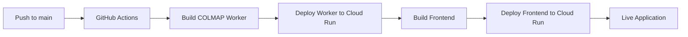

# 🚀 GitHub + Cloud Run Integration Complete!

## ✅ What's Been Set Up

Your COLMAP app is now fully integrated with GitHub and Google Cloud Run:

- **GitHub Actions CI/CD Pipeline**: ✅ Configured
- **Workload Identity Federation**: ✅ Set up (more secure than service account keys)
- **Cloud Build Integration**: ✅ Ready
- **Service Account**: ✅ Created with proper permissions
- **Project Configuration**: ✅ Updated to use `colmap-app` project

## 🔧 Final Steps Required

### 1. Add GitHub Secrets

Go to your GitHub repository settings and add these secrets:

1. **Navigate to**: https://github.com/marco-interact/colmap-app/settings/secrets/actions
2. **Add these repository secrets**:

   ```
   Secret Name: WIF_PROVIDER
   Secret Value: projects/64102061337/locations/global/workloadIdentityPools/github-actions-pool/providers/github-actions-provider
   ```

   ```
   Secret Name: WIF_SERVICE_ACCOUNT
   Secret Value: github-actions-deployer@colmap-app.iam.gserviceaccount.com
   ```

   ```
   Secret Name: GCP_PROJECT_ID
   Secret Value: colmap-app
   ```

### 2. Test the Deployment

Once you add the secrets, any push to the `main` branch will automatically:

1. **Build and deploy** the COLMAP worker to Cloud Run
2. **Build and deploy** the Next.js frontend to Cloud Run
3. **Configure** environment variables automatically
4. **Output** the service URLs

## 🔄 How It Works

### Automatic Deployment Workflow



### Available Deployment Options

1. **Direct Cloud Run Deployment** (`.github/workflows/deploy.yml`)
   - Builds containers directly in GitHub Actions
   - Deploys to Cloud Run using `gcloud run deploy`
   - Faster feedback, more granular control

2. **Cloud Build Integration** (`.github/workflows/cloud-build.yml`)
   - Uses Google Cloud Build for container building
   - More scalable for larger applications
   - Utilizes the `gcp-deployment/cloudbuild.yaml` configuration

## 🔍 Verification Steps

### 1. Check GitHub Actions
- Go to: https://github.com/marco-interact/colmap-app/actions
- Verify workflows are running successfully after adding secrets

### 2. Check Cloud Run Services
- Go to: https://console.cloud.google.com/run?project=colmap-app
- Look for `colmap-worker` and `colmap-frontend` services

### 3. Test Your Application
- Worker URL: Available in Cloud Run console
- Frontend URL: Available in Cloud Run console
- Login: `test@colmap.app` / `password`

## 🛠️ Current Configuration

### Project Details
- **Project ID**: `colmap-app`
- **Project Number**: `64102061337`
- **Region**: `us-central1`

### Service Configuration
- **Worker Service**: `colmap-worker` (4Gi RAM, 2 CPU, 3600s timeout)
- **Frontend Service**: `colmap-frontend` (2Gi RAM, 1 CPU, port 3000)

### Security
- **Authentication**: Workload Identity Federation (no service account keys)
- **Permissions**: Minimal required permissions for deployment
- **Access**: Public (unauthenticated) access to both services

## 🔧 Troubleshooting

### If Deployment Fails

1. **Check GitHub Actions logs**:
   - Go to Actions tab in your repository
   - Click on the failing workflow
   - Review the logs for specific error messages

2. **Common Issues**:
   - Missing GitHub secrets
   - Insufficient permissions (should be resolved)
   - Docker build failures (check Dockerfile syntax)

3. **Manual Deployment** (as fallback):
   ```bash
   # From your project directory
   export PATH="$PATH:/Users/marco.aurelio/google-cloud-sdk/bin"
   gcloud config set project colmap-app
   
   # Deploy worker
   gcloud run deploy colmap-worker \
     --source ./gcp-deployment/colmap-worker \
     --region us-central1 \
     --allow-unauthenticated \
     --memory 4Gi \
     --cpu 2 \
     --timeout 3600
   
   # Deploy frontend
   gcloud run deploy colmap-frontend \
     --source . \
     --region us-central1 \
     --allow-unauthenticated \
     --memory 2Gi \
     --cpu 1 \
     --port 3000
   ```

### If Secrets Are Missing
Re-run the setup script to get the values:
```bash
./setup-workload-identity.sh
```

## 🚀 Next Steps

1. **Add the GitHub secrets** (required for automatic deployment)
2. **Push a small change** to test the pipeline
3. **Monitor the first deployment** in GitHub Actions
4. **Access your live application** via Cloud Run URLs
5. **Set up custom domain** (optional) via Cloud Run console

## 📞 Support

- **GitHub Actions Documentation**: https://docs.github.com/en/actions
- **Cloud Run Documentation**: https://cloud.google.com/run/docs
- **Workload Identity Federation**: https://cloud.google.com/iam/docs/workload-identity-federation

Your COLMAP app is now ready for continuous deployment! 🎉
