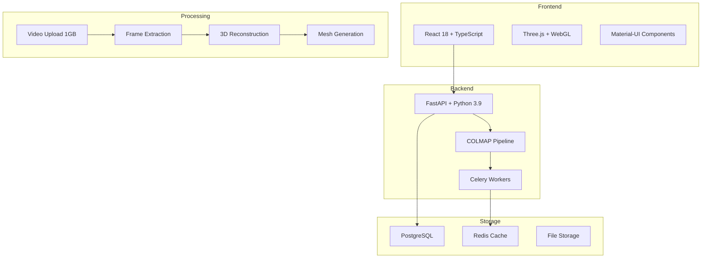
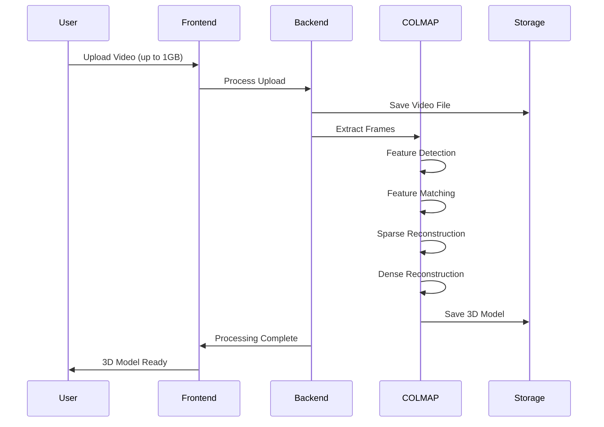

# 🏗️ 3D Visualization and Modeling Platform

[](https://github.com/marco-interact/colmap-app/actions)
[](https://github.com/marco-interact/colmap-app/releases)
[](https://opensource.org/licenses/MIT)

> A comprehensive 3D reconstruction platform that enables users to capture, process, and convert physical spaces into detailed 3D models using photogrammetry and COLMAP.

## ✨ Live Demo

🌟 **[Try the Live Demo](https://your-staging-url.com)** (Coming Soon)

**Demo Credentials:**
- Username: `demo` | Password: `demo123`
- Username: `admin` | Password: `admin123`

## 🎯 Overview

This platform streamlines the workflow from initial documentation through final model delivery, reducing processing time by 60% and improving accuracy for professionals in architecture, real estate, and manufacturing.

### 🚀 Key Features

- **🎥 Video Processing**: Support for 360° video capture and frame extraction (up to 1GB files)
- **🔬 COLMAP Pipeline**: Automated 3D reconstruction using Structure from Motion (SfM)
- **🌐 Interactive 3D Viewer**: Web-based visualization with Three.js and WebGL
- **📏 Measurement Tools**: Precise distance measurements within 3D models
- **👥 Collaborative Tools**: Project management and sharing capabilities
- **📦 Multi-format Export**: Support for PLY, OBJ, glTF formats
- **⚡ Real-time Processing**: Distributed processing with Celery workers
- **📊 Progress Tracking**: Real-time job monitoring and status updates

## 🏗️ Architecture



## 🚀 Quick Start

### Option 1: Docker (Recommended)

```bash
# Clone the repository
git clone https://github.com/marco-interact/colmap-app.git
cd colmap-app

# Start the application
docker-compose up -d

# Access the application
open http://localhost:3000
```

### Option 2: Local Development

```bash
# Clone and setup
git clone https://github.com/marco-interact/colmap-app.git
cd colmap-app

# Backend setup
cd backend
python -m venv venv
source venv/bin/activate  # On Windows: venv\Scripts\activate
pip install -r requirements.txt
uvicorn app.main:app --reload

# Frontend setup (new terminal)
cd frontend
npm install
npm start
```

### Option 3: Staging Environment

For production-like testing:

```bash
# Deploy staging environment
./scripts/staging-deploy.sh

# Access staging
open http://localhost:8080
```

## 📋 System Requirements

### Minimum Requirements
- **OS**: Linux, macOS, or Windows with Docker
- **RAM**: 4GB (8GB+ recommended)
- **Storage**: 10GB free space
- **Docker**: 20.10.0+
- **Docker Compose**: 2.0.0+

### For COLMAP Processing
- **RAM**: 8GB+ recommended
- **CPU**: Multi-core processor
- **GPU**: NVIDIA GPU with CUDA (optional, for acceleration)

## 🎮 User Flow

### 1. Authentication
- Login with demo credentials or create account
- JWT-based authentication with secure sessions

### 2. Project Management
- **Dashboard**: Overview of all projects with search and filtering
- **Create Project**: Set up new 3D reconstruction projects
- **Project Details**: Manage scans, files, and processing

### 3. 3D Reconstruction Workflow



### 4. 3D Visualization & Measurements
- **Interactive Viewer**: Rotate, zoom, pan 3D models
- **Measurement Tools**: Click-to-measure distances
- **Export Options**: Download models in various formats

## 🔧 Configuration

### Environment Variables

Copy `env.example` to `.env` and configure:

```bash
# Database
POSTGRES_SERVER=localhost
POSTGRES_USER=postgres
POSTGRES_PASSWORD=password
POSTGRES_DB=3d_platform

# Redis
REDIS_URL=redis://localhost:6379/0

# COLMAP Settings
COLMAP_QUALITY=medium  # low, medium, high, extreme
MAX_CONCURRENT_JOBS=4
MAX_FILE_SIZE=1073741824  # 1GB

# Frontend
REACT_APP_API_URL=http://localhost:8000/api/v1
```

### COLMAP Quality Settings

| Quality | Max Image Size | Max Features | Processing Time | Output Quality |
|---------|---------------|--------------|-----------------|----------------|
| Low     | 800px         | 4,000        | ~30 min         | Basic          |
| Medium  | 1,200px       | 8,000        | ~60 min         | Good           |
| High    | 1,600px       | 12,000       | ~120 min        | High           |
| Extreme | 2,400px       | 20,000       | ~240 min        | Professional   |

## 📚 API Documentation

### Authentication Endpoints
- `POST /auth/login` - User authentication
- `POST /auth/register` - User registration
- `GET /auth/me` - Get current user

### Project Management
- `GET /projects` - List all projects
- `POST /projects` - Create new project
- `GET /projects/{id}` - Get project details
- `PUT /projects/{id}` - Update project

### File Operations
- `POST /projects/{id}/upload-video` - Upload video (up to 1GB)
- `POST /files/extract-frames` - Extract frames from video
- `GET /files/download/{project_id}/{type}` - Download files

### Processing
- `POST /projects/{id}/start-processing` - Start COLMAP reconstruction
- `GET /jobs` - List processing jobs
- `GET /jobs/{id}` - Get job status

**Full API Documentation**: Available at `/docs` when running the server

## 🧪 Testing

### Running Tests

```bash
# Backend tests
cd backend
pytest tests/ -v --coverage

# Frontend tests
cd frontend
npm test -- --coverage

# Integration tests
./scripts/staging-deploy.sh
# Run your integration tests here
./scripts/staging-stop.sh
```

### Test Coverage

- **Backend**: FastAPI endpoints, COLMAP integration, file handling
- **Frontend**: React components, API integration, 3D viewer
- **Integration**: Complete user workflow, file upload, processing

## 🚀 Deployment

### Staging Environment

```bash
# Deploy to staging
./scripts/staging-deploy.sh

# Check status
./scripts/staging-status.sh

# View logs
./scripts/staging-logs.sh

# Stop staging
./scripts/staging-stop.sh
```

**Staging Access Points:**
- **Main App**: http://localhost:8080
- **API**: http://localhost:8001
- **Monitoring**: http://localhost:5556

### Production Deployment

For production deployment, see [DEPLOYMENT.md](docs/DEPLOYMENT.md)

## 📊 Performance Benchmarks

| Video Length | Frames | Quality | Processing Time | Output Size |
|-------------|--------|---------|-----------------|-------------|
| 30 seconds  | 30     | Medium  | ~15 minutes     | 50MB        |
| 2 minutes   | 120    | High    | ~45 minutes     | 200MB       |
| 5 minutes   | 300    | High    | ~90 minutes     | 500MB       |

### Optimization Tips

- **Video Quality**: Use good lighting and stable camera movement
- **File Size**: Shorter videos = faster processing
- **Hardware**: SSD storage and multi-core CPU recommended
- **Settings**: Choose appropriate quality level for your needs

## 🤝 Contributing

We welcome contributions! Please see our [Contributing Guide](CONTRIBUTING.md) for details.

### Development Setup

1. **Fork** the repository
2. **Clone** your fork
3. **Create** a feature branch
4. **Make** your changes
5. **Test** thoroughly
6. **Submit** a Pull Request

### Code Standards

- **Python**: Follow PEP 8, use Black formatter
- **TypeScript**: Use ESLint, Prettier
- **Tests**: Write tests for new features
- **Documentation**: Update docs as needed

## 📋 Roadmap

### Version 1.1 (Q2 2024)
- [ ] **Real-time Collaboration**: Multiple users per project
- [ ] **Advanced Measurements**: Area and volume calculations
- [ ] **Model Comparison**: Side-by-side 3D model comparison
- [ ] **Export Enhancements**: More formats (FBX, IFC)

### Version 1.2 (Q3 2024)
- [ ] **Mobile App**: iOS and Android companion apps
- [ ] **Cloud Processing**: GPU-accelerated cloud COLMAP
- [ ] **AI Enhancement**: ML-based model improvement
- [ ] **VR Support**: Virtual Reality model viewing

### Version 2.0 (Q4 2024)
- [ ] **Multi-tenant**: SaaS platform with user management
- [ ] **Advanced Analytics**: Processing insights and metrics
- [ ] **API Platform**: Public API for third-party integrations
- [ ] **Enterprise Features**: SSO, advanced security

## 🐛 Issue Reporting

Found a bug? Have a feature request?

1. **Search** existing issues first
2. **Create** a detailed issue with:
   - Steps to reproduce
   - Expected vs actual behavior
   - Screenshots/videos if applicable
   - System information

[**Report an Issue →**](https://github.com/marco-interact/colmap-app/issues)

## 📄 License

This project is licensed under the MIT License - see the [LICENSE](LICENSE) file for details.

## 🙏 Acknowledgments

- **[COLMAP](https://colmap.github.io/)** - 3D reconstruction engine
- **[Three.js](https://threejs.org/)** - 3D graphics library
- **[FastAPI](https://fastapi.tiangolo.com/)** - Web framework
- **[React](https://reactjs.org/)** - Frontend library

## 📞 Support & Community

- **📧 Email**: support@your-domain.com
- **💬 Discussions**: [GitHub Discussions](https://github.com/marco-interact/colmap-app/discussions)
- **🐛 Issues**: [GitHub Issues](https://github.com/marco-interact/colmap-app/issues)
- **📖 Wiki**: [Project Wiki](https://github.com/marco-interact/colmap-app/wiki)

---

<div align="center">

**⭐ Star this repository if you found it helpful!**

[Demo](https://your-demo-url.com) • [Documentation](docs/) • [API Docs](http://localhost:8000/docs) • [Contributing](CONTRIBUTING.md)

Made with ❤️ by [@marco-interact](https://github.com/marco-interact)

</div>
