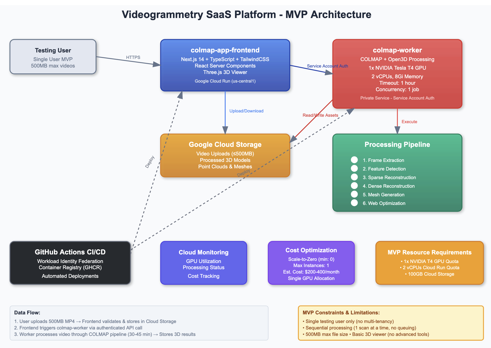

# COLMAP 3D Reconstruction Platform

A GPU-accelerated 3D reconstruction platform using COLMAP for photogrammetry and 3D model generation. Optimized for deployment on Northflank GPU instances.

**Reference**: [Official COLMAP Documentation](https://colmap.github.io/)

## 🚀 Quick Links

- **Backend**: https://p01--colmap-worker-gpu--xf7lzhrl47hj.code.run ([API Docs](https://p01--colmap-worker-gpu--xf7lzhrl47hj.code.run/docs))
- **Frontend**: https://p01--colmap-frontend--xf7lzhrl47hj.code.run
- **GitHub**: https://github.com/marco-interact/colmap-mvp

## 📚 Documentation Hub

| Document | Description |
|----------|-------------|
| **[STATUS_SUMMARY.md](STATUS_SUMMARY.md)** | 📋 Current status, roadmap & next steps |
| **[API_REFERENCE.md](API_REFERENCE.md)** | 🔌 Complete API endpoint documentation |
| **[DATABASE_SETUP.md](DATABASE_SETUP.md)** | 🗄️ Database schema, configuration & testing |
| **[INTEGRATION_GUIDE.md](INTEGRATION_GUIDE.md)** | 🔄 Full pipeline integration steps |
| **[NORTHFLANK_REBUILD.md](NORTHFLANK_REBUILD.md)** | 🔧 How to deploy code changes |
| **[DEPLOY_TO_NORTHFLANK.md](DEPLOY_TO_NORTHFLANK.md)** | 🚀 Initial deployment guide |

## 🎯 Current Status (80% Complete)

✅ Backend deployed with GPU (A100 40GB)  
✅ Frontend deployed and online  
✅ Database fully implemented  
✅ COLMAP compiled and ready  
⏳ Database endpoints awaiting deployment  
⏳ Frontend → Backend integration pending  

**Next Step**: Deploy database endpoints on Northflank (see [NORTHFLANK_REBUILD.md](NORTHFLANK_REBUILD.md))



## 🚀 Features

- **GPU-Accelerated Processing**: Utilizes NVIDIA CUDA for fast 3D reconstruction
- **COLMAP Pipeline**: Industry-standard photogrammetry with Structure-from-Motion (SfM)
- **Video-to-3D**: Upload videos and automatically extract frames for reconstruction
- **Multiple Quality Levels**: Low, medium, and high-quality reconstruction options
- **RESTful API**: FastAPI-based backend with comprehensive endpoints
- **Cloud Storage**: Integrated Google Cloud Storage support
- **Real-time Progress**: Track reconstruction progress with detailed stage information
- **Auto-scaling**: Scales based on demand with rate limiting and job queueing

## 🏗️ Architecture

### Backend Stack
- **Framework**: FastAPI (Python 3.11)
- **3D Processing**: COLMAP 3.9.1 with GPU support
- **Database**: SQLite for project/scan management
- **Storage**: Google Cloud Storage integration
- **Containerization**: Docker with NVIDIA CUDA support

### Frontend Stack
- **Framework**: Next.js 14 (TypeScript)
- **3D Rendering**: Three.js with React Three Fiber
- **UI Components**: Tailwind CSS + Radix UI
- **State Management**: React Hooks

## 📋 Prerequisites

### For Development
- Docker Desktop with GPU support (for local testing)
- Python 3.11+
- Node.js 18+ (for frontend)
- NVIDIA GPU with CUDA 11.8+ support

### For Northflank Deployment
- Northflank account with GPU instance access
- GitHub repository connected to Northflank
- Google Cloud Storage bucket (optional, for file storage)

## 🚀 Quick Start

### 1. Clone Repository

```bash
git clone https://github.com/marco-interact/colmap-mvp.git
cd colmap-mvp
```

### 2. Configure Environment

Copy the example environment file:

```bash
cp .env.example .env
```

Edit `.env` with your configuration:

```env
PORT=8080
COLMAP_CPU_ONLY=false
STORAGE_BUCKET=your-bucket-name
DATABASE_PATH=/app/data/colmap_app.db
```

### 3. Local Development with Docker

Build and run the GPU-enabled worker:

```bash
# Build Docker image
docker build -f Dockerfile.northflank -t colmap-worker-gpu .

# Run with GPU support
docker run --gpus all -p 8080:8080 \
  -e PORT=8080 \
  -e COLMAP_CPU_ONLY=false \
  colmap-worker-gpu
```

### 4. Test the API

```bash
# Health check
curl http://localhost:8080/health

# Check GPU availability
curl http://localhost:8080/ | jq .gpu_enabled
```

## 🌐 Northflank Deployment

### Step 1: Connect GitHub Repository

1. Go to Northflank dashboard
2. Create new service → Deploy from Git
3. Connect your GitHub account
4. Select `marco-interact/colmap-mvp` repository

### Step 2: Configure Build Settings

- **Build Type**: Dockerfile
- **Dockerfile Path**: `Dockerfile.northflank`
- **Build Context**: `/`

### Step 3: Configure Runtime Settings

#### GPU Configuration
- **Instance Type**: GPU Instance
- **GPU Type**: NVIDIA T4 or A10G
- **GPU Count**: 1

#### Resources
- **CPU**: 2-4 vCPUs
- **Memory**: 4-8 GB RAM
- **Storage**: 10 GB ephemeral

#### Environment Variables
Set these in Northflank console:

```
PORT=8080
COLMAP_CPU_ONLY=false
CUDA_VISIBLE_DEVICES=0
NVIDIA_VISIBLE_DEVICES=all
STORAGE_BUCKET=colmap-processing-bucket
DATABASE_PATH=/app/data/colmap_app.db
MAX_CONCURRENT_JOBS=4
```

### Step 4: Configure Networking

- **Port**: 8080
- **Protocol**: HTTP
- **Health Check Path**: `/health`
- **Health Check Interval**: 30s

### Step 5: Deploy

Click **Deploy** and monitor the build logs. First deployment may take 15-20 minutes due to COLMAP compilation.

## 📡 API Endpoints

### Health & Status

```bash
# Basic health check
GET /health

# Service information
GET /

# Readiness probe
GET /readiness
```

### Video Processing

```bash
# Upload video for processing
POST /upload-video
Content-Type: multipart/form-data

Fields:
- video: video file (MP4, MOV, AVI)
- project_id: project UUID
- scan_name: name for the scan
- quality: "low" | "medium" | "high"
- user_email: user email address

Response:
{
  "job_id": "uuid",
  "scan_id": "uuid",
  "status": "pending",
  "message": "Video uploaded successfully"
}
```

### Job Status

```bash
# Check processing status
GET /jobs/{job_id}

Response:
{
  "job_id": "uuid",
  "status": "processing",
  "progress": 60,
  "current_stage": "Feature Matching",
  "message": "Matching features between images...",
  "results": null
}
```

### Scan Details

```bash
# Get detailed scan information
GET /scans/{scan_id}/details

Response:
{
  "id": "scan_id",
  "name": "My Scan",
  "status": "completed",
  "technical_details": {
    "point_count": 45892,
    "camera_count": 24,
    "processing_time": "4.2 minutes"
  },
  "processing_stages": [...]
}
```

### Project Management

```bash
# Create user
POST /users?email=user@example.com&name=John Doe

# Get user projects
GET /users/{email}/projects

# Create project
POST /projects
{
  "user_email": "user@example.com",
  "name": "My Project",
  "description": "Project description",
  "location": "Building A"
}

# Get project scans
GET /projects/{project_id}/scans
```

## 🔧 COLMAP Pipeline Details

### Processing Stages

1. **Frame Extraction** (10-20s)
   - Extracts key frames from video
   - Adaptive sampling based on quality settings
   - 30-100 frames depending on quality

2. **Feature Detection** (30-60s with GPU)
   - SIFT feature extraction
   - GPU-accelerated when available
   - ~8,000 features per frame

3. **Feature Matching** (1-3 min with GPU)
   - Exhaustive or sequential matching
   - GPU-accelerated matching
   - Establishes image correspondences

4. **Sparse Reconstruction** (1-5 min)
   - Structure-from-Motion (SfM)
   - Camera pose estimation
   - Sparse 3D point cloud generation

5. **Dense Reconstruction** (2-10 min with GPU)
   - Multi-view stereo (MVS)
   - Dense point cloud generation
   - Optional mesh generation

### Quality Settings

| Quality | Frames | Resolution | GPU Time | CPU Time |
|---------|--------|------------|----------|----------|
| Low     | 30     | 800px      | ~3 min   | ~15 min  |
| Medium  | 50     | 1600px     | ~6 min   | ~30 min  |
| High    | 100    | 2400px     | ~15 min  | ~60 min  |

## 🐳 Docker Images

### Production (GPU-enabled)
- **Base**: `nvidia/cuda:11.8.0-cudnn8-devel-ubuntu22.04`
- **COLMAP**: v3.9.1 with CUDA support
- **Size**: ~8 GB
- **Build Time**: 15-20 minutes

### Development (CPU-only)
- **Base**: `python:3.11-slim`
- **COLMAP**: CPU-only build
- **Size**: ~2 GB
- **Build Time**: 5-10 minutes

## 📊 Performance Benchmarks

### GPU (NVIDIA T4)
- Frame Extraction: 0.8s
- Feature Detection: 45s (50 frames)
- Feature Matching: 1.2 min
- Sparse Reconstruction: 1.8 min
- Dense Reconstruction: 4-5 min
- **Total**: ~8-10 minutes

### CPU (4 cores)
- Frame Extraction: 1.2s
- Feature Detection: 180s (30 frames)
- Feature Matching: 5 min
- Sparse Reconstruction: 8 min
- Dense Reconstruction: 15-20 min
- **Total**: ~30-40 minutes

## 🔒 Security Features

- Non-root container execution
- Rate limiting (20 requests/minute)
- Job queueing with concurrency limits
- Automatic cleanup of temporary files
- Environment-based secrets management
- CORS configuration
- Health check endpoints

## 🔍 Monitoring & Debugging

### Health Check Response
```json
{
  "status": "healthy",
  "service": "colmap-worker",
  "version": "1.0.0",
  "gpu_status": true,
  "active_gpu_jobs": 2,
  "max_gpu_jobs": 4,
  "memory_usage": "2458.3MB",
  "timestamp": "2025-10-14T10:30:00"
}
```

### Logs
Monitor application logs in Northflank dashboard:

```bash
# Feature extraction
{"timestamp": "2025-10-14 10:30:15", "level": "INFO", "message": "Running feature extraction"}

# GPU detection
{"timestamp": "2025-10-14 10:30:16", "level": "INFO", "message": "GPU detected: NVIDIA T4"}
```

### Common Issues

**Issue**: GPU not detected
- Check NVIDIA_VISIBLE_DEVICES environment variable
- Verify GPU instance is properly configured
- Check CUDA drivers in container logs

**Issue**: Out of memory
- Reduce MAX_CONCURRENT_JOBS
- Lower quality settings for processing
- Increase instance memory allocation

**Issue**: Slow processing
- Verify GPU is being used (check logs)
- Check if COLMAP_CPU_ONLY is set to false
- Monitor active_gpu_jobs count

## 📁 Project Structure

```
colmap-mvp/
├── main.py                     # FastAPI application
├── database.py                 # SQLite database layer
├── requirements.txt            # Python dependencies
├── Dockerfile.northflank       # GPU-optimized Dockerfile
├── northflank.json            # Northflank configuration
├── .env.example               # Environment template
├── README.md                  # This file
├── src/                       # Frontend source
│   ├── app/                  # Next.js app directory
│   ├── components/           # React components
│   ├── lib/                  # Utilities
│   └── types/                # TypeScript types
├── gcp-deployment/            # Google Cloud configs
└── public/                    # Static assets
```

## 🛠️ Development

### Run Tests

```bash
# Test COLMAP installation
docker run --gpus all colmap-worker-gpu colmap --version

# Test database
python -c "from database import db; print(db.get_connection())"

# Test API locally
pip install -r requirements.txt
python main.py
```

### Frontend Development

```bash
cd colmap-mvp
npm install
npm run dev
# Open http://localhost:3000
```

## 🤝 Contributing

1. Fork the repository
2. Create a feature branch (`git checkout -b feature/amazing-feature`)
3. Commit your changes (`git commit -m 'Add amazing feature'`)
4. Push to the branch (`git push origin feature/amazing-feature`)
5. Open a Pull Request

## 📝 License

This project is licensed under the MIT License.

## 📞 Support

- **Issues**: [GitHub Issues](https://github.com/marco-interact/colmap-mvp/issues)
- **Documentation**: [Northflank Docs](https://northflank.com/docs)
- **COLMAP**: [COLMAP Documentation](https://colmap.github.io/)

## 🙏 Acknowledgments

- [COLMAP](https://colmap.github.io/) - 3D reconstruction software
- [FastAPI](https://fastapi.tiangolo.com/) - Modern web framework
- [Next.js](https://nextjs.org/) - React framework
- [Three.js](https://threejs.org/) - 3D graphics library
- [Northflank](https://northflank.com/) - Cloud deployment platform

---

**Made with ❤️ for 3D reconstruction**
